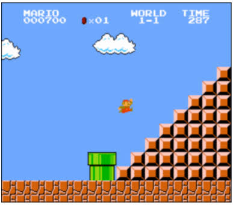

# CS50x

CS50 is a face-to-face and online computer science course at Harvard University.  

This course is divided into weeks, and each week has a central topic and problem to solve.  

I made this repository to show the things studied in this course.  

## Lecture 0 (Scratch)

The week 0 is about principles of computers world 
- How to computer representing data (yes, with binary) 
- What is a algorithms 
- Time to solve problems (the bigO notation)
- ✨Scratch ✨

### Problem Set 0

In this class, I learned about scratch, and the proposed set of problems was to create something with scratch, and i made a game.

My project is a retro game, similar to pong, but for one player. To play, click [here!](https://scratch.mit.edu/projects/778158229/)

## Lecture 1 (C language)

In this class, i apprehended the fundamentals of programming with C, things already seen with Scratch, now using C and new concepts using this text-based language. (Correctness, Design, Style, Syntax, IDE, Compiling, Functions, Arguments, Return Values, Types, Operators, Variables and so on)

### Problem Set 1

In this week, have 2 problems to solve, the version of problem if you feel most confortable and if you feel less confortable too

### Mario Pyramids 

the first problem set, is based in make a mario pyramid, using c.  

| Mario less confortable version                | Program in c                                   |
|:---------------------------------------------:| ---------------------------------------------- |
|  |  <pre>$ ./mario            Height: 4    #   ##  ### #### </pre> |

| Mario more confortable version               | Program in c                                   |
|:--------------------------------------------:| ---------------------------------------------- |
|  | <pre>$ ./mario            Height: 4    #  #   ##  ##  ###  ### ####  #### </pre> |

Can you check my solutions clicking [here!](https://github.com/jotavev/cs50x/tree/master/lecture1/pset1/)

### Cash and Credit

The second problem set involves money 🤑 (and it's not hack a ATM).

Cash is a greedy algorithm to minimize the number of coins you’re dispensing for each customer when giving changes, the input are the value of change and the output are the number of coins you have to give.

| Cash                                        |
|---------------------------------------------|
| <pre>$ ./cash Change Owed: -41                Change Owed: foo Change Owed: 41 4</pre> |

Credit is a credit card checker. the input are the credit card number is `INVALID` for invalid number, and if valid, the program check what is the flag of card, return `VISA`, `MASTERCARD` and `AMEX`.

| Credit                                      |
|---------------------------------------------|
|  <pre>$ ./credit  Number: 4003600000000014        VISA $ ./credit Number: 371449635398431 AMEX Number: 6176292929 INVALID</pre> |

Can you check my solutions clicking [here!](https://github.com/jotavev/cs50x/tree/master/lecture1/pset1/)

